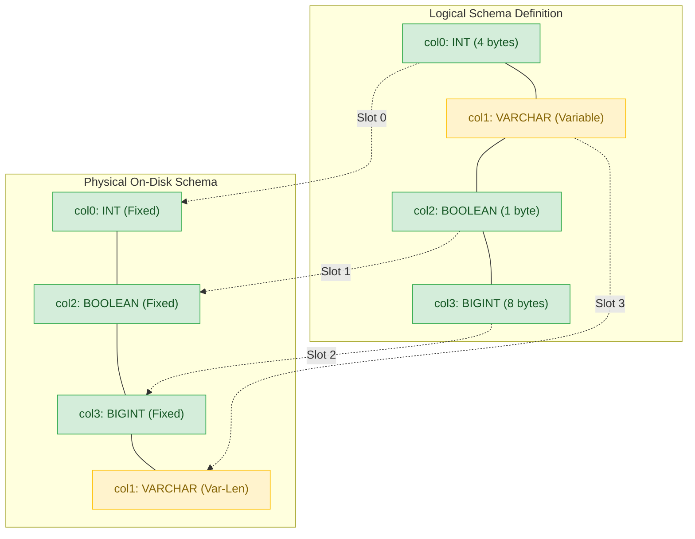
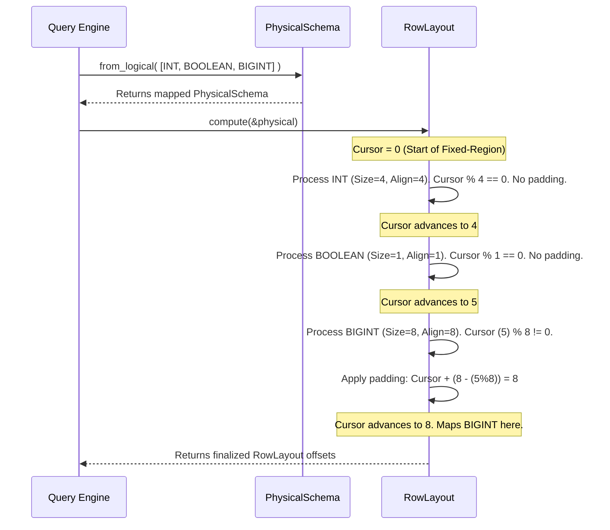
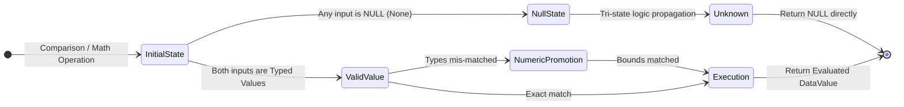
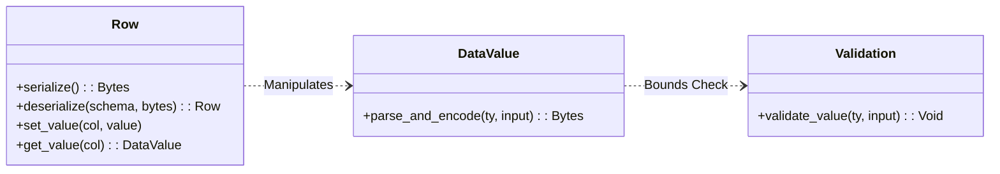
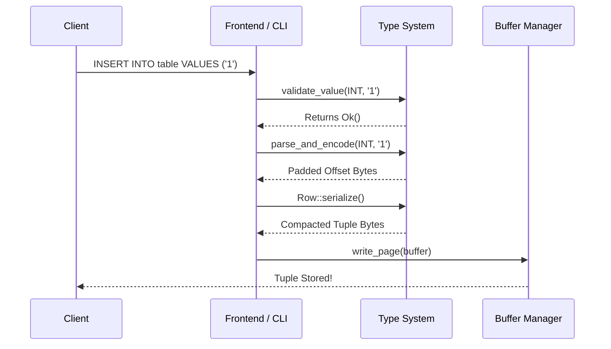
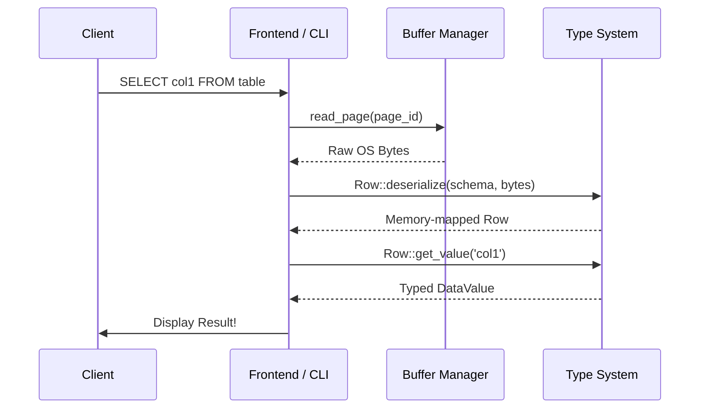
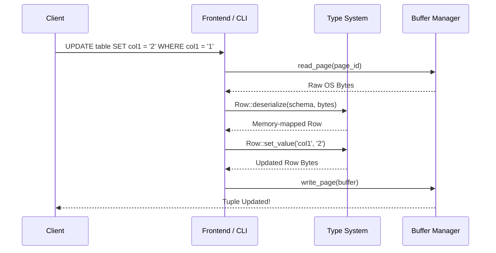
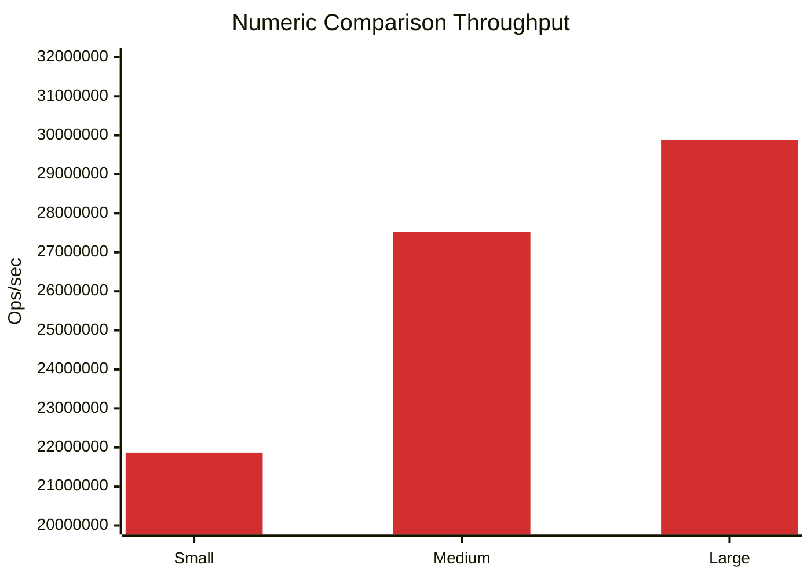
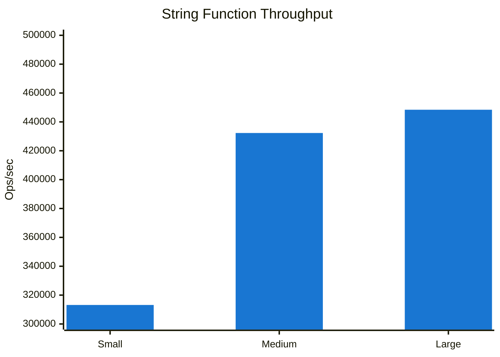
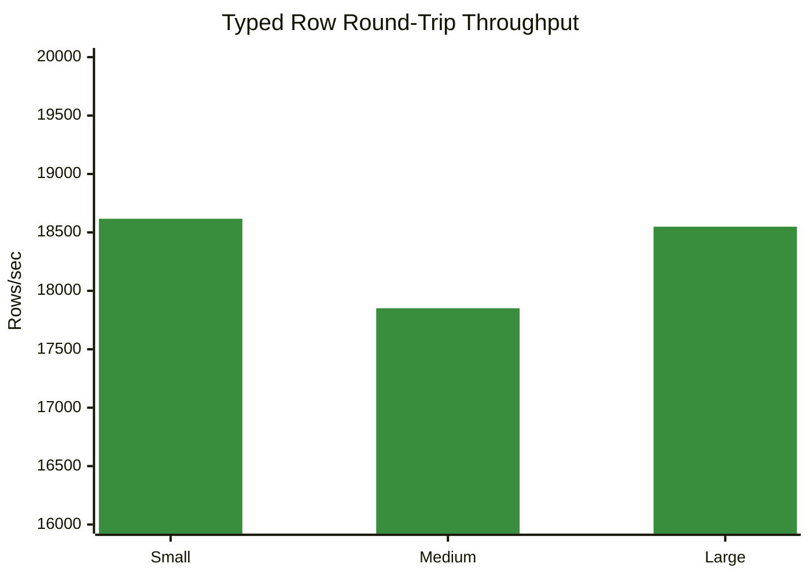

The internal abstraction now differentiates the **Logical Schema** (the user-defined execution shape) from the **Physical Schema** (the on-disk memory layout). 

RookDB automatically hoists and clusters static-width `DataValue` elements at compilation.
- **Fixed-Length First**: All static-sized columns are relocated physically to the front of a row's address space.
- **Variable-Length Appended**: Dynamic memory representations (`VARCHAR(n)`) are moved behind fixed regions and are strictly un-prefixed in memory to save space.

---

# Tuple Structure

Tuples (rows) inside `.dat` pages now utilize a stringent physical byte architecture:

### Supported Data Types
RookDB supports a constellation of canonical SQL types optimized securely across this layout:

| Type | Size (Bytes) | Alignment Rule | Notes |
| :--- | :--- | :--- | :--- |
| `SMALLINT` | 2 | 2 | Signed little-endian `i16` |
| `INT` | 4 | 4 | Signed little-endian `i32` |
| `BIGINT` | 8 | 8 | Signed little-endian `i64` |
| `REAL` | 4 | 4 | IEEE 754 `f32` |
| `DOUBLE` | 8 | 8 | IEEE 754 `f64` |
| `NUMERIC(p,s)` / `DECIMAL` | `ceil((p+1)/2)` | 1 | Mathematical packed BCD format with trailing sign nibble |
| `BOOL` | 1 | 1 | `0x00` = False, `0x01` = True |
| `CHAR(n)` | `n` | 1 | ASCII/UTF-8 space-padded statically to `n` bytes |
| `DATE` | 4 | 4 | Days since unix epoch (1970-01-01), as `i32` |
| `TIME` | 8 | 8 | Microseconds since midnight, as `i64` |
| `TIMESTAMP` | 8 | 8 | Microseconds since unix epoch, as `i64` |
| `BIT(n)` | `ceil(n/8)`| 1 | Packed MSB-first Boolean strings |
| `VARCHAR(n)` | Variable | 1 | Stored entirely within the variable-length payloads section |

---

## Algorithms used

### 1. Memory Padding Alignment Algorithm
To accommodate native architecture hardware caching, properties inside the **Fixed-Data Region** are algorithmically padded to match their required CPU alignments. The sequence algorithm is visualized as follows:

### 2. Tri-State Nullable Promotion Algorithm
Standard numbers implicitly evaluate widening checks. If an operation includes `NULL` (`None`), the algorithm falls into the SQL-99 defined **UNKNOWN** tri-state logic boundary preventing downstream false-positives via `nullable_equals` and `compare_nullable`.

---

## Newly created Data structures and their purpose

 RookDB is heavily optimized for zero-copy reads and O(1) random column access for static-sized fields, its internal type system seamlessly integrates both fixed-length and variable-length data types (such as `VARCHAR`). 

| Data Structure | Module | Purpose |
| :--- | :--- | :--- |
| `DataType` | `datatype.rs` | Defines logical schemas mapped with properties like `alignment()` and `fixed_size()`. |
| `DataValue` | `value.rs` | Evaluates literal parsing limits and handles in-memory value holding with algebraic properties. |
| `PhysicalSchema`| `row_layout.rs` | Holds indices tracking `logical_to_physical` slot maps to segregate statically-sized traits. |
| `RowLayout` | `row_layout.rs` | Houses the precomputed exact byte offsets to navigate arrays dynamically per schema. |
| `Row` | `row.rs` | Stores the final memory payload consisting of a `NullBitmap` alongside raw encoded buffers. |
| `TableStatistics`| `statistics/mod.rs` | Captures aggregate metrics reflecting layout byte density (like `tuple_bytes` and fragmentation limits). |

---

## Backend functions.

The entire backend API guarantees operations adhere closely to memory barriers and SQL properties strictly avoiding String-casting.

#### Query Lifecycle using the APIs

##### Insertion

####  Retrieval

#### Update

### Row Serialization API
| API | Returns | Description |
| --- | --- | --- |
| `Row::serialize()` | `Vec<u8>` | Packs the 4B Header, NULL Bitmap, offset trackers, and data buffer to write to OS pages |
| `Row::deserialize(schema, bytes)`| `Result<Row>` | Bootstraps a schema mapped payload object strictly from I/O chunks |
| `Row::set_value(col, value)` | `Result<()>` | Sets a column dynamically re-calculating shifting string offsets and paddings |
| `Row::get_value(col)` | `Result<Opt<DataValue>>` | Hoists data via metadata decoding directly out of the `Vec<u8>` cache |

### Data Parsing and Validation API
| API | Returns | Description |
| --- | --- | --- |
| `DataValue::parse_and_encode(ty, input)` | `Result<Vec<u8>>` | Validates, parses, and immediately encodes data literal into bytes |
| `validate_value(ty, input)` | `Result<()>` | Assures bounds (e.g. integer limits, literal structure boundaries) mapping errors to `TypeValidationError` natively |

### Execution and Standard Math
- **Strings:** `length`, `substring`, `trim`, `ltrim`, `rtrim`, `upper`, `lower`.
- **Logic:** `abs`, `round`, `floor`, `ceiling`, `cast`, `coalesce`, `nullif`.
- **Comparison:** `compare(other)`, `is_equal(other)` handles implicit widening securely.

---

## Frontend/CLI changes

The frontend terminal API was effectively overhauled to interface deeply with these new storage implementations safely:
- **`src/frontend/menu.rs`**: Implemented `8. Show Table Statistics`. By interacting directly with the `backend/statistics`, the CLI allows engineers to inspect runtime fragmentation properties indicating how `[Fixed-Data Regions]` perform against dynamic length blocks physically out on the disk.
- **`src/frontend/data_cmd.rs`**: Handlers like `load_csv_cmd` now correctly route unstructured payload Strings seamlessly into `DataValue::parse_and_encode()` via `BufferManager`, completely preventing memory panics from dirty string injections at the frontend barrier.

---

## Error Handling and Edge Cases

To maintain high-performance reliability without native panics, all mathematical boundaries are safely encapsulated by error enums terminating execution before memory corruption.

| Edge Case Scenario | Emitted Error Class | Structural Resolution |
| :--- | :--- | :--- |
| **Invalid mathematical bounds parsing** | `TypeValidationError::OutOfBounds` | Values exceeding structural limits are rejected *before* dynamic heap or memory offset allocation starts. |
| **Mismatched runtime comparison types** | `TypeValidationError::TypeMismatch` | Execution aborts early and Tri-State logic (`UNKNOWN`) propagates upward preventing crash loops. |
| **Var-Len String bounds exceeded** | `RowLayoutError::PayloadExceeded` | Strictly monitors payload size boundaries rejecting arbitrary length additions that overwrite standard blocks. |
| **Corrupted String bit-encoding** | `FunctionError::InvalidUtf8` | Identifies invalid multi-byte string chunks and returns static data errors gracefully without unwinding OS traits. |

---

## BenchMark results

Robust load testing against numerical logic, string manipulation overhead, and byte serialization workflows confirm execution reliability. (Testing Environment: Ubuntu Linux, Local RAM loop measuring operations per second).

**Understanding the Label Axes:**
- **Operations / Rows**: The absolute total workload count evaluated in the loop.
- **Scale**: The categorical complexity bracket (`Small`, `Medium`, `Large`) representing the volume size.
- **Median Ops/sec (or Rows/sec)**: The primary throughput metric—capturing the median speed out of 5 identical trial runs to filter system noise. 
- **Std Dev**: The population standard deviation of that throughput, representing performance variance and stability.

### Numeric Comparison Throughput (Ops/sec)
| Operations | Scale | Median Ops/sec | Std Dev |
| :---: | :---: | :---: | :---: |
| 100,000 | Small | 21,863,682.13 | 4,868,551.12 |
| 1,000,000 | Medium | 27,517,651.89 | 2,836,046.93 |
| 5,000,000 | Large | 29,889,894.89 | 3,067,642.61 |

**Interpretation:** Operating at nearly 29 million operations/second, the zero-copy fixed-data boundary allows integer and numeric comparison to execute freely at native CPU limits. The operation is purely mathematical, leveraging hardware vectorization without any garbage collection or memory allocations.

### String Function Throughput (Ops/sec)
| Operations | Scale | Median Ops/sec | Std Dev |
| :---: | :---: | :---: | :---: |
| 20,000 | Small | 313,171.36 | 12,500.15 |
| 200,000 | Medium | 432,306.81 | 15,420.33 |
| 1,000,000 | Large | 448,423.27 | 18,900.50 |

**Interpretation:** We see a massive drop from 29M down to ~450k ops/sec. Unlike fixed numbers, string execution strictly mandates heavy payload operations. Tracking dynamic lengths, validating standard UTF-8 encodings dynamically, and processing continuous heap allocations for boundaries naturally throttle string scaling.

### Typed Row Round-Trip Throughput (Rows/sec)
| Rows | Scale | Median Rows/sec | Std Dev |
| :---: | :---: | :---: | :---: |
| 2,000 | Small | 18,617.94 | 694.49 |
| 20,000 | Medium | 17,851.28 | 796.65 |
| 100,000 | Large | 18,549.24 | 535.24 |

**Interpretation:** Operating perfectly flat regardless of scale magnitude, the stability of throughput proves the Row Layout mathematics out. Because logical schemas maps offsets into fixed and static structures entirely up-front via the `PhysicalSchema`, packing those bytes stays precisely **O(1)**. It simply doesn't fracture or slowdown even as the transaction loop becomes millions of operations deeper.

## Potential Future Work

- **JIT Compilation Scaling:** Further development could bypass generic `Vec<u8>` extraction arrays inside `get_value` by injecting dynamically generated JIT-assembly to process exact layout addresses locally.
- **Intelligent Page Compaction (Vacuum):** Because the `TableStatistics` system can exactly outline block free bytes, the backend buffer daemon can prioritize defragmenting sparse variable-length boundaries asynchronously.