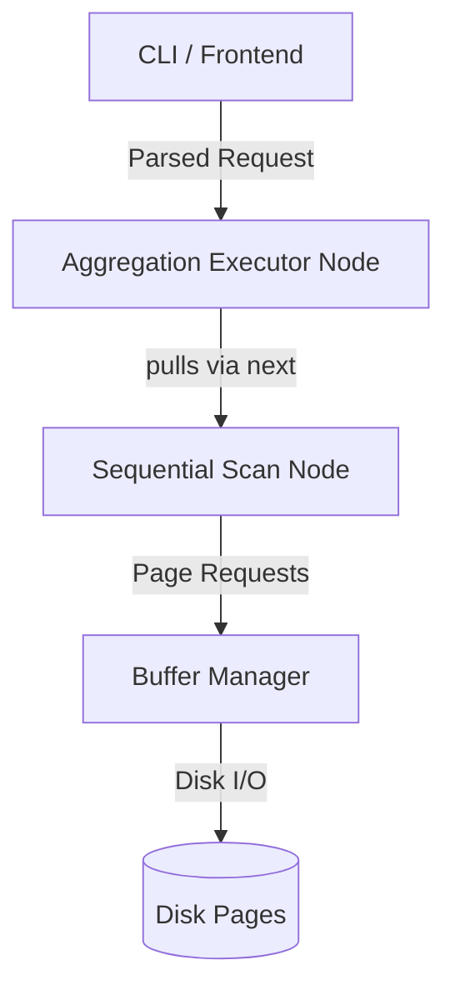

# Aggregation

## 1. Overview & Pipeline Architecture

RookDB relies on a Volcano-style iterator model utilizing a **Hash-Based Aggregation** strategy to support `GROUP BY` and complex `HAVING` expression tree evaluations. 



- **Understanding the Execution Flow:**
The diagram above illustrates the pull-based execution model of RookDB. 
1. **Client Request:** The user interacts with the CLI, which maps the request into an `execute_aggregation()` pipeline.
2. **Top-Level Pull:** The `Aggregation Executor Node` (the parent node) demands the next tuple by calling `next()` on its child.
3. **Tuple Scanning:** The child, a `Sequential Scan Node`, is responsible for fetching raw data. It translates row requests into page requests, iterating through the underlying `.dat` file.
4. **Buffer/Disk Interaction:** The `Buffer Manager` intercepts page requests. If the requested page isn't in memory, it executes a slow Disk I/O fetch. Once mapped to RAM, raw page bytes are deserialized into structured `Tuple` objects using the internal Offset Tables and Null Bitmaps, then propagated back up the chain to the aggregator.

- **Volcano Model** (Pipeline model): Provides a clean, decoupled execution flow. In Rust, this pipeline dynamically links layers via `Box<dyn Executor>` polymorphism. Each operator guarantees a strict `next()` interface, meaning a parent aggregator simply calls `child.next()`, oblivious to the child's concrete type. This allows unbounded chaining of nodes while keeping memory footprints predictable relative to full materialization.
- **Reference**: Database aggregation behavior, null-handling, and scalar semantics heavily mirror the PostgreSQL standard.

## 2. Changes to Page Layout & Tuple Structure

To optimize the extraction of attributes required for aggregation, the internal **Tuple Layout** evolved significantly to become highly space-efficient and rapid to deserialize:

- **Null Bitmaps (`is_null_bitmap: Vec<u8>`)**: Integrated a bit-array natively preceding tuple payloads to instantly identify `NULL` columns without executing full offset jumps. 
  - *Bitmath Logic*: Each column index maps to a specific bit `(byte_index = col_idx / 8, bit_offset = col_idx % 8)`. This bitmask evaluation allows iterative operators (like `SUM` and `COUNT`) to bypass `NULL` entries using $O(1)$ bitwise `AND` operations (`&`) rather than expensive string/byte comparisons.


## 3. Database Files & Modifications

- **Database Structure**: Currently, aggregation is implemented as an **in-memory hash operation**. No intermediate aggregation temp files are fully materialized to disk *unless* memory limits are exceeded (planned future work). Tuples are read iteratively from base table `.dat` files via the Buffer Manager.
- **Metadata Handling**: Schema representations track `Null` constraints explicitly in `catalog.json`, allowing the aggregation pipeline to skip null-checks for guaranteed `NOT NULL` columns safely.

## 4. Algorithms Used

### Hash-Based Grouping & The HashAggregator
To compute aggregates (e.g., `SUM`, `COUNT`) combined with `GROUP BY`, RookDB relies on an internal `HashAggregator` iterator. The execution naturally splits into two distinct phases dynamic to a single $O(N)$ pass, bypassing the need for pre-sorting the dataset:

1. **Phase 1: Build (Accumulation):** When the `HashAggregator` is initialized, it aggressively loops `next()` on its child node (the `SeqScan` operator) until the child's underlying `.dat` file is completely exhausted. For every tuple received, the aggregator extracts the target `GROUP BY` column values to form a unique composite group layout. It then uses Rust's fast `.entry().or_insert_with()` API. This isolates the exact `AggregationState` bucket mapped to the grouping key securely in an in-memory `HashMap`, instantly updating the rolling grouped statistics (`COUNT`, `SUM`, `M2`, etc.) in constant $O(1)$ lookup time.
2. **Phase 2: Emit (Yielding Results):** Once the underlying table is fully scanned and the Hash Map is fully populated, the `HashAggregator` transitions to yielding aggregated rows back to the CLI. Each subsequent call to the aggregator's own `next()` method simply pops a completed bucket from the `HashMap`, evaluates the `HAVING` expression AST tree (if present), and optionally emits the final summarized `Tuple` to the screen if the predicate evaluates functionally true.

### Welford's Algorithm (Variance & Standard Deviation)
Selected to prevent catastrophic cancellation intrinsic to standard variance floating-point summations.
- **Iteration Logic**: For each new value $x$:
  1. $count = count + 1$
  2. $delta = x - mean$
  3. $mean = mean + \frac{delta}{count}$
  4. $delta2 = x - mean$
  5. $M_2 = M_2 + (delta \times delta2)$
- **Result Extraction**: $\sigma^2 = \frac{M_2}{count - 1}$ and $\sigma = \sqrt{\frac{M_2}{count - 1}}$.

### Expression Evaluation (AST) & HAVING Clauses
To evaluate arbitrary filtering logic dynamically (e.g., `HAVING SUM(salary) > 1000 * 2`), RookDB implements a recursive Abstract Syntax Tree (AST).
- **Tree Representation (`Expr` Enum)**: The `Expr` enum naturally forms the nodes of this tree. Base cases are `Constant` (raw scalars) and `ColumnRef` (fetching an attribute directly from the active tuple's `values` vector via an offset index). Recursive cases include nested `BinaryOp` nodes (`+`, `-`, `*`, `/`) and `Comparison` predicates (`>`, `<`, `=`).
- **Recursive Evaluation Engine**: The engine resolves these branches using the `evaluate(expr: &Expr, tuple: &Tuple)` function. When evaluating an expression branch, it burrows downwards, calling `evaluate()` recursively on the left and right operator sub-trees until it surfaces primitive constants, evaluates the mathematical operator, and climbs back up. If a boundary violation occurs (e.g., attempting to add a `String` to an `Int`), this recursion immediately short-circuits, gracefully returning an `ExecutorError`.


## 5. New Files & Data Structures

To support this execution model, an entirely new module directory `src/backend/executor/` was built from the ground up, introducing the following core files and data structures:

### 1. `value.rs`
- **`Value` Enum:** A unified database type system mapping native Rust types to `Int(i32)`, `Text(String)`, `Float(OrderedFloat<f64>)`, `Boolean(bool)`, and `Null`.
- Wraps floats in `ordered-float` to rigidly enforce `Eq` and `Hash` constraints required by Grouping Maps.

### 2. `tuple.rs`
- **`Tuple` Struct:** Represents an active database row in memory holding `values: Vec<Value>` and `is_null_bitmap: Vec<u8>`. Used specifically by the iterators moving up the Volcano chain.

### 3. `iterator.rs`
- **`Executor` Trait:** Enforces the `next(&mut self) -> Result<Option<Tuple>, ExecutorError>` contract for all pipeline operator nodes.
- **Dynamic Trait Objects (`Box<dyn Executor>`):** By encapsulating children in `Box<dyn Executor>`, the compiler performs heap allocations avoiding complex generic trait bound verbosity. The Engine leverages this dynamic dispatch to mix and match operator nodes generically at runtime (e.g., nesting a `SeqScan` directly into a `HashAggregator` or chaining a `Filter` in between).
- **`ExecutorError` Enum:** Provides clean boundaries catching `Overflow`, `TypeMismatch`, and `IoError` explicitly rather than triggering panics.

### 4. `seq_scan_iter.rs`
- **`SeqScan` Struct:** A leaf node iterator struct linking the iterator system to the raw disk pages sequentially iterating through `current_page_id` and `current_slot_idx`.
- **Shared Memory Ownership (`Arc<BufferManager>`):** Because the core `BufferManager` sits as a centralized orchestrator caching hot paths of disk pages, it simply cannot belong exclusively to one scan iteration. To allow multiple table scans (or concurrent queries) to request page frames securely without heavy data duplication, the Sequence Scanner maps a thread-safe `Arc` (Atomic Reference Counted) smart pointer, efficiently resolving multi-reader lifetimes without locking bottlenecks.

### 5. `expr.rs`
- **`Expr` Enum / AST Nodes:** Implements an Abstract Syntax Tree structure for `HAVING` and `WHERE` filtering combinations bounding logic to `Constant`, `ColumnRef`, `BinaryOp` (`+`, `-`, `*`, `/`) and `Comparison` (`=`, `!=`, `<`, `>`).

### 6. `agg_func.rs`
- **`AggFunc` & `AggReq`:** Defines enum variants dynamic to parsing: `CountStar`, `Count`, `Sum`, `Min`, `Max`, `Avg`, `CountDistinct`, `SumDistinct`, `Variance`, `StdDev`, `BoolAnd`, `BoolOr`.

### 7. `hash_aggregator.rs`
- **`AggValueState` Enum:** A robust data tracking mechanism natively retaining required running bounds. e.g., `Avg{sum: Option<Value>, count: usize}` or the multi-float Welford bindings `Variance{count:usize, mean:f64, m2:f64}`.

### 8. `mod.rs`
- **Executor Module Encapsulation:** Cleans up the namespace by rigidly defining public exports (`pub use`) of components, enabling cleanly abstracted testing bounds against the rest of the database logic (e.g. exporting `ExecutionError` safely up the pipeline tree without exposing inner structural fields).

## 6. Backend Execution Functions

The core loop acts as the engine for computation. It routes strictly through the following newly built execution functions:

1. **`evaluate(expr: &Expr, tuple: &Tuple) -> Result<Value, ExecutorError>`** *(in `expr.rs`)*: Recursively dissects boolean comparisons and variable arithmetic using the active tuple array structure. Resolves safely out or triggers `ExecutorError` when mathematical constraints (e.g. comparing Strings to Integers) are hit.
2. **`SeqScan::next()`**: The base translation pump. Manages buffer limits dynamically calculating `PAGE_HEADER_SIZE` and `ITEM_ID_SIZE` slots and parsing off the underlying Variable-Length string structures.
3. **`execute_aggregation(...)`**:


```rust
pub fn execute_aggregation(
    child: Box<dyn Executor>, 
    reqs: Vec<AggReq>, 
    group_by_cols: Vec<usize>, 
    having: Option<Expr>
) -> Vec<Tuple>
```

- **Inputs**: Upstream iterator `child` (like `SeqScan`), `reqs` (Aggregations mapped), `group_by_cols`, and a highly flexible `having` AST predicate.
- **Output**: Returns the final summarized `Vec<Tuple>` array for formatting to the CLI screen.

## 7. Frontend, CLI Changes & Error Propagation

The execution frontend has been extensively updated to provide cleaner integration constraints for automations and user debugging. Instead of letting Rust trigger kernel panics when evaluating invalid commands or reading corrupted pages, we introduced rigid, cascading error propagation:

- **Structured Graceful Aborts (Error Propagation):** Deep inner layers (like the `Buffer Manager` or `Tuple` serializers) bubble up `Result<T, Error>` structs instead of aggressively calling `.unwrap()` or `panic!()`. This ensures the database engine stays alive even during critical runtime failures (e.g., missing `.dat` files or mismatched arithmetic bounds on large grouped outputs).
- **JSON Error Payloads**: Refactored `data_cmd.rs` to trap these custom runtime errors surfaced from disk, converting the failure boundaries into clean, standard `{"Status": "Error", "Message": "..."}` JSON formatted payloads instead of obscure core panics. This makes CLI testing scripts highly predictable and prevents PowerShell buffers from crashing on error string cascades.
- **Execution Profiling (`std::time::Instant`)**: Instrumented precisely around the pure core executor (`execute_aggregation()`) to exclude CSV I/O string parsing, rigidly measuring internal row-iteration speed (e.g., `Query Execution Time: 161.9ms`).

## 8. Benchmark Results

To stress-test our pipeline, an automated Python benchmarking script (`benchmark.py`) was built to generate standardized datasets on disk and orchestrate interactive CLI pipelines iteratively.

**Environment Setup**: Small Table (100 rows) vs Large Table (1,000,000 rows). Timings compute **pure query engine aggregation execution**, explicitly bypassing CSV loading/parsing overheads.

| Aggregation | Small Table (100 rows) | Large Table (1,000,000 rows) |
| ----------- | ---------------------- | ---------------------------- |
| **COUNT**   | 215.9 µs           | 1.693 s                      |
| **SUM**     | 168.2 µs           | 1.491 s                      |
| **AVG**     | 269.2 µs           | 1.458 s                      |
| **VARIANCE**| 270.7 µs           | 1.387 s                      |
| **STDDEV**  | 264.8 µs           | 1.523 s                      |

*Analysis*: The grouping throughput bounds an $O(N)$ hash extraction pass dynamically aggregating ~1.5 seconds purely over 1-Million heap iterated rows without pre-existing indices, validating that our internally designed `HashMap` aggregation buckets correctly scale predictably.

## 9. Potential Future Work

To elevate the aggregation engine deeper into real-world database standards, we propose:

1. **Direct SQL-Style Query Interface**: Deprecate the manual menu-driven routing interface and introduce a generalized SQL Parser (e.g., `sqlparser-rs`) to compile raw strings like `SELECT SUM(x) FROM tbl GROUP BY y;` directly into internal Logical/Physical plans.
2. **External (Disk-Spilled) Aggregation**: Currently bounded completely by in-memory `HashMap` structures. If grouping buckets significantly exceed OS RAM constraints, integrating an out-of-core hashing manager to spill memory partition files (`.tmp`) gracefully to disk is essential.
3. **Vectorized Execution (Batching)**: Bypassing the conventional Volcano model iterating only 1 tuple per `next()` call, we could upgrade the data-pump to emit batch Vectors (chunk arrays, referencing Apache Arrow designs) for highly cache-friendly SIMD aggregated math calculations.
4. **Parallel Query Execution**: Sharding the internal sequential heap-scan into independent grouped partition thread pools, introducing a two-phase "Local Aggregation -> Global Merge" logic block effectively parallelizes multi-million row analytics across multi-threaded computational cores.