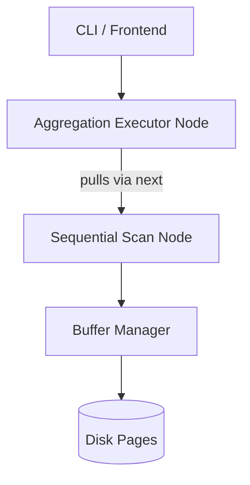

# Aggregation

## 1. Overview & Pipeline Architecture

RookDB relies on a Volcano-style iterator model utilizing a **Hash-Based Aggregation** strategy to support `GROUP BY` and complex `HAVING` expression tree evaluations. 



- **Volcano Model** (Pipeline model): Provides a clean, decoupled execution flow. Each operator implements a strict `next()` method, making it simple to chain nodes and keep memory footprints predictable relative to full materialization.
- **Reference**: Database aggregation behavior, null-handling, and scalar semantics heavily mirror the PostgreSQL standard.

## 2. Changes to Page Layout & Tuple Structure

To optimize the extraction of attributes required for aggregation, the internal **Tuple Layout** evolved significantly:

- **Null Bitmaps**: Integrated a bit-array natively preceding tuple payloads to instantly identify `NULL` columns without executing full offset jumps. This allows operators (like `SUM` and `COUNT`) to bypass `NULL` entries in `O(1)` time.
- **Variable-Length Offset Tables**: For strings/varchar (e.g., `category` grouping keys), an offset table manages varying byte lengths. We extract grouping keys directly via these internal byte offset boundaries out of the disk pages into the Buffer Manager.

## 3. Database Files & Modifications

- **Database Structure**: Currently, aggregation is implemented as an **in-memory hash operation**. No intermediate aggregation temp files are fully materialized to disk *unless* memory limits are exceeded (planned future work). Tuples are read iteratively from base table `.dat` files via the Buffer Manager.
- **Metadata Handling**: Schema representations track `Null` constraints explicitly in `catalog.json`, allowing the aggregation pipeline to skip null-checks for guaranteed `NOT NULL` columns safely.

## 4. Algorithms Used

### Hash-Based Grouping
Utilizes hashing over an array of `Value` primitives. The engine maps tuple keys to aggregation buckets dynamically in a single `O(N)` pass, bypassing the need for pre-sorting the dataset.

### Welford's Algorithm (Variance & Standard Deviation)
Selected to prevent catastrophic cancellation intrinsic to standard variance floating-point summations.
- **Iteration Logic**: For each new value $x$:
  1. $count = count + 1$
  2. $delta = x - mean$
  3. $mean = mean + \frac{delta}{count}$
  4. $delta2 = x - mean$
  5. $M_2 = M_2 + (delta \times delta2)$
- **Result Extraction**: $\sigma^2 = \frac{M_2}{count - 1}$ and $\sigma = \sqrt{\frac{M_2}{count - 1}}$.

## 5. Newly Created Data Structures

- **`AggFunc` Enum**: Defines the variants supported by the parsed query dynamically.
  ```rust
  pub enum AggFunc {
      CountStar, Count, Sum, Min, Max, Avg,
      CountDistinct, SumDistinct, Variance, StdDev,
      BoolAnd, BoolOr
  }
  ```
- **`HashMap<Vec<Value>, AggregationState>`**: The primary tracking structure mapping grouped buckets to their rolling statistics (`count`, `sum`, `M2`, etc.) utilizing Rust's Entry API (`entry().or_insert_with()`).
- **`ordered-float` Wrappers**: Native `f64` primitives are wrapped to strictly satisfy Rust's `Eq` and `Hash` constraints, safely enabling them inside `HashSet` and `HashMap`.

## 6. Backend Functions

The core aggregation loop relies on the following execution signature:

```rust
pub fn execute_aggregation(
    child: Box<dyn Executor>, 
    reqs: Vec<AggReq>, 
    group_by_cols: Vec<usize>, 
    having: Option<Expr>
) -> Vec<Tuple>
```

- **Inputs**: 
  - `child`: Upstream iterator data source.
  - `reqs`: Array of aggregation function variants to compute.
  - `group_by_cols`: Target column indices defining the grouping key.
  - `having`: Optional recursive AST (`Expr`) used for mathematical/boolean filtering tree evaluation.
- **Output Format**: Returns `Vec<Tuple>` representing completely aggregated, grouped, and filtered rows.

## 7. Frontend & CLI Changes

The execution frontend has been extensively updated to provide cleaner integration constraints for automations and user debugging:

- **JSON Error Payloads**: Refactored `data_cmd.rs` to cleanly abort with standard `{"Status": "Error", ...}` JSON formatted payloads upon catching invalid schemas or types, standardizing boundary panics.
- **Execution Profiling (`std::time::Instant`)**: Instrumented precisely around the pure core executor (`execute_aggregation()`) to exclude CSV I/O string parsing, rigidly measuring internal row-iteration speed (e.g., `Query Execution Time: 161.9ms`).

## 8. Benchmark Results

To stress-test our pipeline, an automated Python benchmarking script (`benchmark.py`) was built to generate standardized datasets on disk and orchestrate interactive CLI pipelines iteratively.

**Environment Setup**: Small Table (100 rows) vs Large Table (1,000,000 rows). Timings compute **pure query engine aggregation execution**, explicitly bypassing CSV loading/parsing overheads.

| Aggregation | Small Table (100 rows) | Large Table (1,000,000 rows) |
| ----------- | ---------------------- | ---------------------------- |
| **COUNT**   | 215.9 µs           | 1.693 s                      |
| **SUM**     | 168.2 µs           | 1.491 s                      |
| **AVG**     | 269.2 µs           | 1.458 s                      |
| **VARIANCE**| 270.7 µs           | 1.387 s                      |
| **STDDEV**  | 264.8 µs           | 1.523 s                      |

*Analysis*: The grouping throughput bounds an $O(N)$ hash extraction pass dynamically aggregating ~1.5 seconds purely over 1-Million heap iterated rows without pre-existing indices, validating that our internally designed `HashMap` aggregation buckets correctly scale predictably.

## 9. Potential Future Work

To elevate the aggregation engine deeper into real-world database standards, we propose:

1. **Direct SQL-Style Query Interface**: Deprecate the manual menu-driven routing interface and introduce a generalized SQL Parser (e.g., `sqlparser-rs`) to compile raw strings like `SELECT SUM(x) FROM tbl GROUP BY y;` directly into internal Logical/Physical plans.
2. **External (Disk-Spilled) Aggregation**: Currently bounded completely by in-memory `HashMap` structures. If grouping buckets significantly exceed OS RAM constraints, integrating an out-of-core hashing manager to spill memory partition files (`.tmp`) gracefully to disk is essential.
3. **Vectorized Execution (Batching)**: Bypassing the conventional Volcano model iterating only 1 tuple per `next()` call, we could upgrade the data-pump to emit batch Vectors (chunk arrays, referencing Apache Arrow designs) for highly cache-friendly SIMD aggregated math calculations.
4. **Parallel Query Execution**: Sharding the internal sequential heap-scan into independent grouped partition thread pools, introducing a two-phase "Local Aggregation -> Global Merge" logic block effectively parallelizes multi-million row analytics across multi-threaded computational cores.