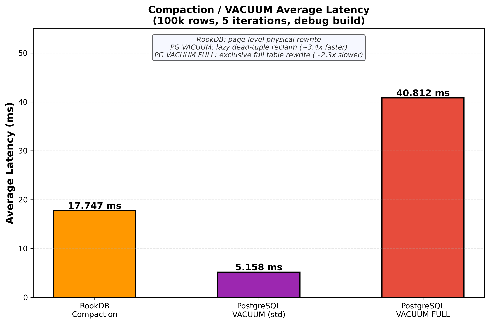
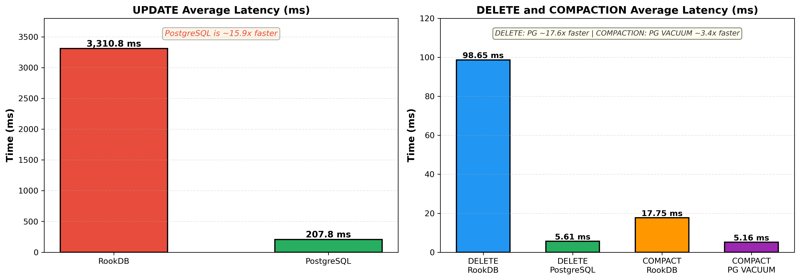

# Benchmark Results

All benchmarks run against a **debug build** (`cargo run --bin benchmark_compare`) on a local macOS machine. RookDB is compared to a local PostgreSQL instance.

---

## Setup

| Parameter | Value |
|---|---|
| Rows | 100 000 |
| Iterations | 5 |
| Update predicate | `id <= 50000` |
| Update assignment | `score = score + 10` |
| Delete predicate | `id <= 20000` |
| Build profile | debug |
| PostgreSQL schema | `public` |

The RookDB seed file (100 000 rows) is copied fresh before each iteration so every sample starts from an identical table state.

---

## RookDB Summary (debug build, rook-only)

| Operation | Average | Fastest | Slowest | Total |
|---|---:|---:|---:|---:|
| UPDATE | 3 310.813 ms | 3 128.560 ms | 3 463.800 ms | 16 554.066 ms |
| DELETE | 98.649 ms | 97.017 ms | 101.215 ms | 493.244 ms |
| COMPACTION | 17.747 ms | 13.284 ms | 31.394 ms | 88.737 ms |

---

## PostgreSQL Baseline (same conditions)

| Operation | Average | Fastest | Slowest | Total |
|---|---:|---:|---:|---:|
| UPDATE | 201.111 ms | 168.552 ms | 233.010 ms | 1 005.556 ms |
| DELETE | 5.224 ms | 4.902 ms | 6.248 ms | 26.120 ms |
| VACUUM (std) | 5.158 ms | 4.535 ms | 6.577 ms | 25.789 ms |
| VACUUM FULL | 40.812 ms | 39.361 ms | 42.185 ms | 204.061 ms |

---

## RookDB vs PostgreSQL — Average Latency Comparison

| Operation | RookDB avg | PostgreSQL avg | Result |
|---|---:|---:|---|
| UPDATE | 3 310.813 ms | 201.111 ms | PostgreSQL ~16.5× faster |
| DELETE | 98.649 ms | 5.224 ms | PostgreSQL ~18.9× faster |
| COMPACTION vs std VACUUM | 17.747 ms | 5.158 ms | PostgreSQL ~3.4× faster |
| COMPACTION vs VACUUM FULL | 17.747 ms | 40.812 ms | **RookDB ~2.3× faster** |

---

## Compaction Analysis



RookDB compaction is a **full page rewrite** — it visits every page that has dead tuples and rewrites it from scratch. This is architecturally equivalent to PostgreSQL's `VACUUM FULL` (which also rewrites the entire table and holds an exclusive lock). Against that baseline, RookDB is ~2.3× faster.

PostgreSQL's standard `VACUUM` is an **incremental lazy sweep** — it reclaims dead tuple slots in-place without rewriting the full page, which is why it completes in ~5 ms. RookDB does not yet have an equivalent incremental mode.

---

## UPDATE Analysis



RookDB UPDATE is significantly slower because each matched row requires:
1. A page-level write lock acquisition.
2. A soft-delete of the old slot.
3. An FSM-guided heap insertion for the new version (which may land on a different page).

PostgreSQL's UPDATE is an in-place MVCC version replacement that avoids an extra heap insert for rows that fit in the same page.

---

## How to Reproduce

```bash
# RookDB-only benchmark (no PostgreSQL required)
cd code
cargo run --bin benchmark_compare -- --rook-only

# Full comparison against local PostgreSQL
cargo run --bin benchmark_compare -- \
  --pg-url "postgresql://<user>@localhost:5432/postgres" \
  --pg-schema "public"
```
